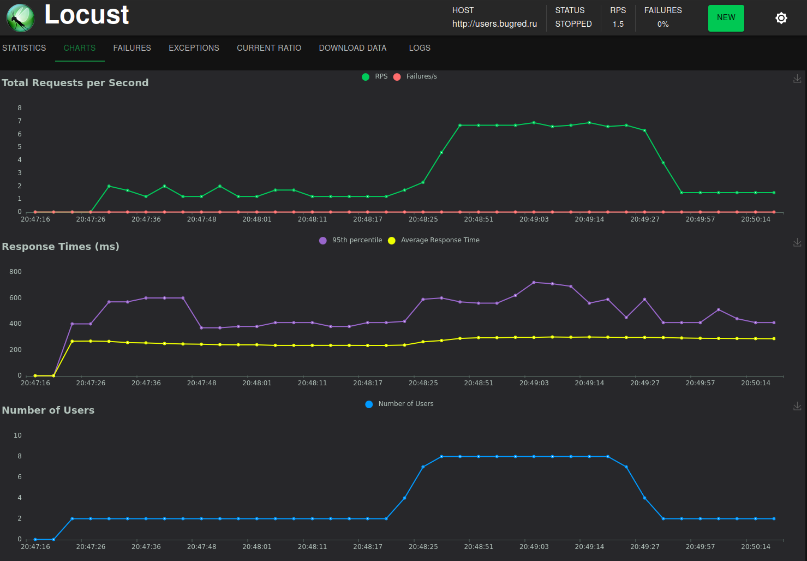
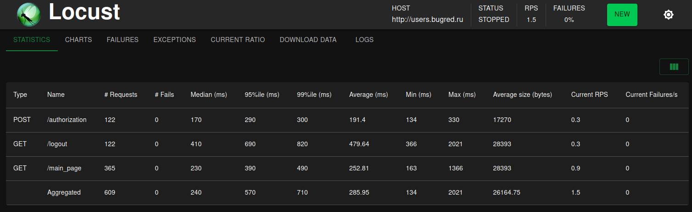

# Locust-Tests-Users
Тестирование сайта <a href="http://users.bugred.ru/">Users</a> (Нагрузочное тестирование)

## Описание

Цель проекта: получение навыков в написание автоматизированных нагрузочных авто тестов на Locust. Сайт для тестирования (<a href="http://users.bugred.ru/">Users</a>).

## Технологии

- Python 3.10
- Locust
- Grafana
- InfluxDB
- Grafana

### Запуск тестов

Запуск из console команда: (locust -f src/test/users_authorization_test.py)

## Мониторинг

Графики (Locust)

Статистика (Locust)

