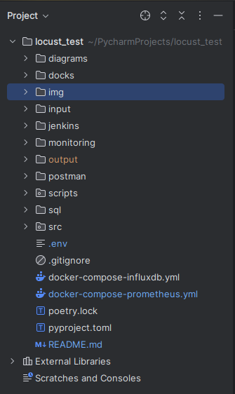
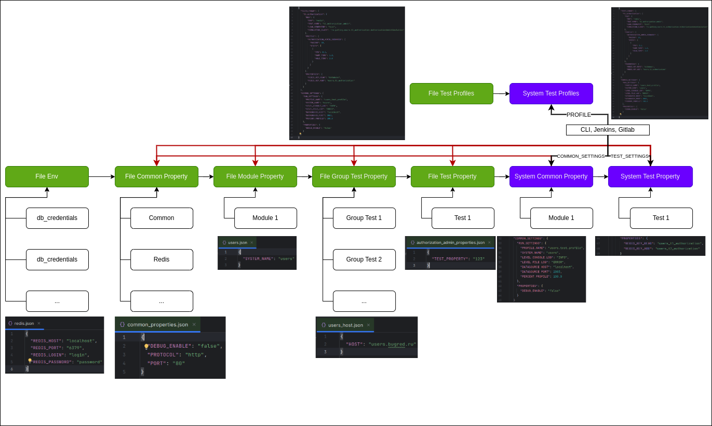
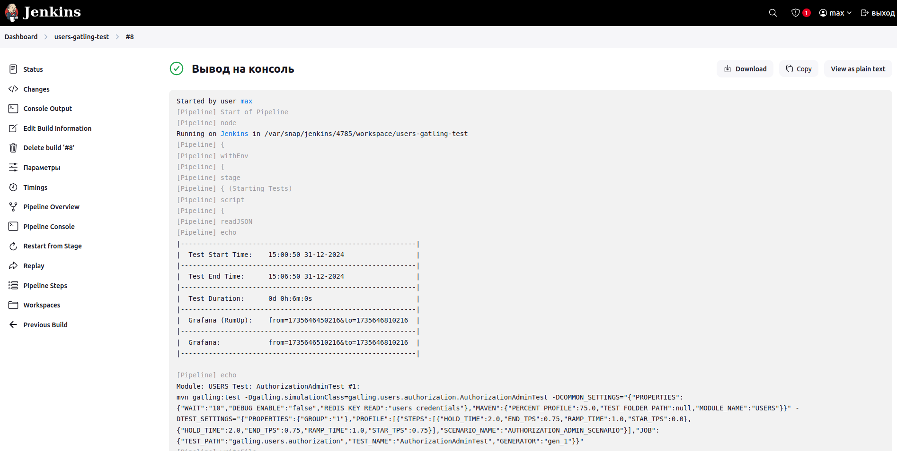
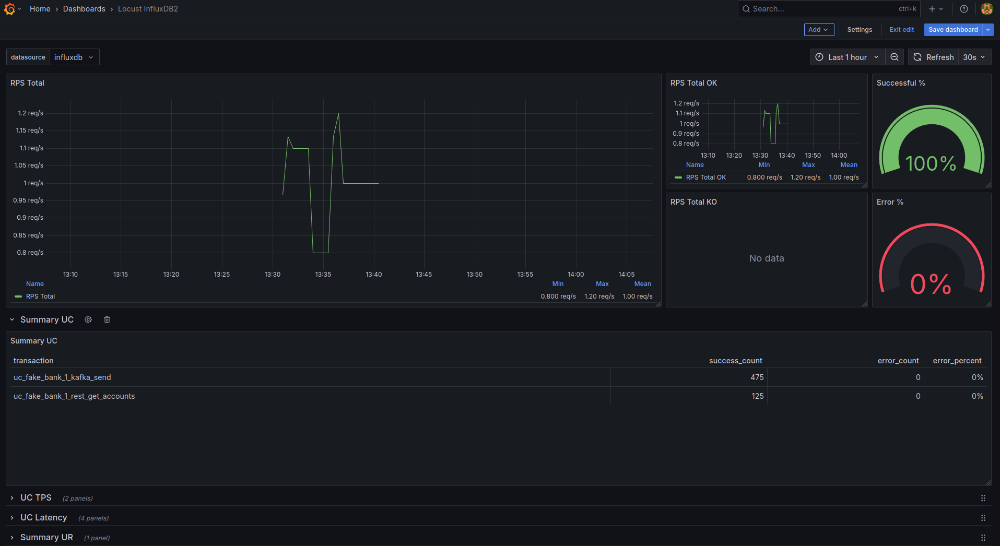
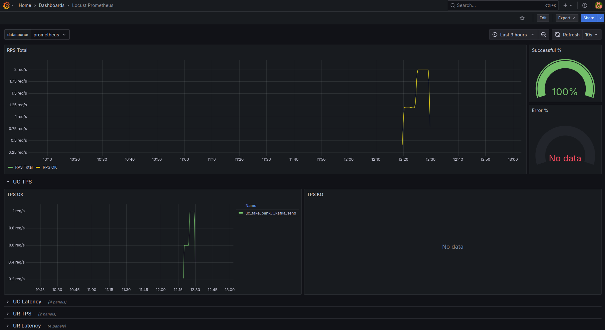

# Locust Test


Пример тестового фреймворка для быстрого старта на Locust

1. [Список систем](#список-систем)
2. [Kubernetes](#kubernetes)
3. [Структура каталогов](#структура-каталогов)
   - 3.1 [Структура проекта](#структура-проекта)
   - 3.2 [Структура папки common](#структура-папки-common)
   - 3.3 [Структура системы](#структура-системы)
4. [Структура тестов](#структура-тестов)
5. [Работа с Properties в проекте](#работа-с-properties-в-проекте)
6. [Правила оформления кода в проекте](#правила-оформления-кода-в-проекте)
   - 6.1 [Наименование файлов](#наименование-файлов)
   - 6.2 [Наименование переменных](#наименование-переменных)
   - 6.3 [Наименование scenario, steps и transaction](#наименование-scenario-steps-и-transaction)
7. [Профиль нагрузки](#профиль-нагрузки)
8. [Проверка тестов перед запуском](#проверка-тестов-перед-запуском)
9. [Запуск тестов](#запуск-тестов)
   - 9.1 [Запуск через CLI](#запуск-через-cli)
   - 9.2 [Запуск тестов через Jenkins](#запуск-тестов-через-jenkins)
10. [Мониторинг](#мониторинг)
    - 10.1 [InfluxDB](#influxdb)
    - 10.2 [Prometheus](#prometheus)
11. [Вспомогательные скрипты для работы c redis](#вспомогательные-скрипты-для-работы-c-redis)
    - 11.1 [Получить информации о Redis и Key](#получить-информации-о-redis-и-key)
    - 11.2 [Проверка количества данных в Redis](#проверка-количества-данных-в-redis)
    - 11.3 [Добавить данные в Redis](#добавить-данные-в-redis)
    - 11.4 [Прочитать данные из Redis](#прочитать-данные-из-redis)
    - 11.5 [Скачать дамп по ключу](#скачать-дамп-по-ключу)
    - 11.6 [Загрузить дамп в Redis](#загрузить-дамп-в-redis)
    - 11.7 [Удалить ключи по паттерну](#удалить-ключи-по-паттерну)
    - 11.8 [Удалить все ключи из Redis](#удалить-все-ключи-из-redis)
12. [Вспомогательные скрипты](#вспомогательные-скрипты)
    - 12.1 [Автоматическая генерация профиля для прегенерации данных](#автоматическая-генерация-профиля-для-прегенерации-данных)
    - 12.2 [Изменение шагов в профиль](#изменение-шагов-в-профиль)
    - 12.3 [Класс для сохранения путей до тестовых классов](#класс-для-сохранения-путей-до-тестовых-классов)
    - 12.4 [Сумматор профилей](#сумматор-профилей)
13. [TODO](#todo)

## Список систем

- [System Common](docks/system_common/SYSTEM_COMMON.md)
- [System Fake Bank](docks/system_fake_bank/SYSTEM_FAKE_BANK.md)
- [System Reqres](docks/system_reqres/SYSTEM_REQRES.md)

## Kubernetes

**system_common** - NT Prod
**system_petstore** - NT Prod
**system_users** - NT Prod

## Структура каталогов



### Структура проекта

- **diagrams** - Вспомогательные диаграммы, взаимодействия тестов (draw.io)
- **docks** - Документация систем (users, ...)
- **img** - Картинки для документации
- **input** - Данные для тестов, пулы данных, логины пароли от баз
  - **data_pool** - Пул данных для тестов
  - **debug_tests** - Config для проверки теста
  - **env** - Secretes для postgres, kafka, redis, ...
  - **pre_gen_config** - Конфиг для прегенерации данных
  - **ssl_kafka** - Kafka сертификаты
  - **step_generator** - Конфиг для изменения шагов профиля
- **jenkins** - Pipeline для Jenkins
- **monitoring** - Настройки для InfluxDB и дашборды для Grafana
- **postman** - Postman коллекции
- **scripts** - Вспомогательные скрипты (запуск, тестов, ...)
- **sql** - Запросы SQL для подготовки данных или подготовки базы перед тестом
- **src** - Исходный код
- **.env** - Для docker-compose
- **.gitignore** - Файлы, которые игнорируем
- **docker-compose-influxdb.yml** - grafana + influxdb
- **docker-compose-prometheus.yml** - grafana + prometheus
- **README.md** - Документация проекта

### Структура папки common

- **common** - Общие скрипты для тестов
  - **helpers** - Вспомогательные скрипты
  - **models** - PoJo скрипты для сериализации и десериализации

### Структура системы

- **pre_test** - Скрипты подготовки перед запуском тестов
- **system_common** - Название системы
- **system_fake_bank** - Название системы
      - **__common** - Общие скрипты
      - **t1_get_accounts** - Тестовый сценарий системы fake bank
          - **helpers** - Вспомогательные классы системы
          - **authorization_test** - Тест 1
      - **t2_kafka** - Тестовый сценарий системы fake bank

## Структура тестов

Пример тестового сценария:

```python
import json

from locust import task, HttpUser, LoadTestShape, constant_pacing

import src.tests.__common.helpers.add_arguments_helper  # noqa: F401
# import src.tests.__common.hooks.prometheus_hooks  # noqa F401
import src.tests.__common.hooks.influxdb2_hooks  # noqa F401
from src.tests.__common.clients.httpx_client import HttpClient
from src.tests.__common.decorators.transaction import Transaction
from src.tests.__common.helpers.property_helper import PropertyHelper
from src.tests.__common.models.stage.stages_config import StagesConfig

# Профиль нагрузки по умолчанию
STAGES = [{"duration": 60, "users": 1, "spawn_rate": 1}]


# Сценарий
class GetAccounts(HttpUser):
    # Хост
    host = "localhost"
    # Клиент HTTPX
    httpx_client = None

    def __init__(self, *args, **kwargs) -> None:
        super().__init__(*args, **kwargs)
        # Параметры из системы
        options = self.environment.parsed_options
        # Debug enable
        self.debug_enable = options.DEBUG_ENABLE.strip().lower() == "true"
        # Pacing
        self.__class__.wait_time = constant_pacing(options.PACING)
        # Профиль нагрузки
        stages_str = options.STAGES
        if stages_str is not None:
            StagesConfig.model_validate_json(stages_str)
            global STAGES
            STAGES = json.loads(stages_str)
        # Properties
        self.properties = PropertyHelper.read_properties(
            options.PROPERTIES,
            "src/resources/properties/__common/common_properties.json",
            "src/resources/properties/tests/system_fake_bank/fake_bank.json",
            "src/resources/properties/tests/system_fake_bank/__groups/fake_bank_host.json",
            "src/resources/properties/tests/system_fake_bank/t1_get_accounts/get_accounts_properties.json"
        )
    
    # Действие перед тестом
    def on_start(self) -> None:
        # Инициализация httpx клиента
        self.httpx_client = HttpClient(
            timeout=10.0,
            client_url=self.properties.get("FAKE_BANK_HOST"),
            environment=self.environment
        )
    
    # Тест
    @task
    @Transaction("uc_fake_bank_1_rest_get_accounts")
    def get_accounts_scenario(self) -> None:
        self.httpx_client.get(
            "/fakebank/accounts",
            extensions={"request_name": "ur_fake_bank_1.1_rest_get_/fakebank/accounts"},
        )

        if self.debug_enable:
            self.environment.runner.quit()
    
    # Действие после теста
    def on_stop(self) -> None:
        # Закрываем клиент
        self.httpx_client.close()


# Нагрузка
class StagesShape(LoadTestShape):
    def tick(self) -> tuple[int, int] | None:
        run_time = self.get_run_time()
        for stage in STAGES:
            if run_time < stage["duration"]:
                return stage["users"], stage["spawn_rate"]
        return None
```

## Работа с Properties в проекте

Подробнее с диаграммой можно ознакомиться **diagrams/property.drawio**



Пример использования в коде:

```textmate
self.properties = PropertyHelper.read_properties(
    options.PROPERTIES,
    "src/resources/properties/__common/common_properties.json",
    "src/resources/properties/tests/system_fake_bank/fake_bank.json",
    "src/resources/properties/tests/system_fake_bank/__groups/fake_bank_host.json",
    "src/resources/properties/tests/system_fake_bank/t1_get_accounts/get_accounts_properties.json"
)
```

## Правила оформления кода в проекте

### Наименование файлов

- Наименование тестов **`<Название класса>_test`**
- Наименование профилей **`<Название системы>_<Название профиля>_<Процент профиля>%_<Количество шагов>_steps_profile.json`**

### Наименование переменных

- Для имен переменных JS использовать **lowerCamelCase**
- Для названия классов JS использовать **UpperCamelCase**
- Аббревиатуры также писать CamelCase, например **SqlSelect**, а не **SQLSelect**
- Для названия каталогов и файлов использовать **lower_snake_case**

### Наименование scenario, steps и transaction

- Использовать **lower_snake_case**
- Названия сценария (scenario) **`<SCENARIO_NAME>_SCENARIO`**
- Названия групп (transaction) **`uc_<system_name>_<script_code (1)>_<operation_name (kafka, rest, ...)>_<group_name, endpoint - (если в группе одна операция)>`**
- Название шагов (steps) **`ur_<system_name>_<script_code (1.1)>_<operation_name (kaffka, rest, ...)>_<operation_type (get, post, delete, send, ...)>_<step_name, endpoint>`**
- Названия запросов к Database или Redis начинать с **`db_<system_name>_<script_code>_<database_host>_<table_name, key_name>`**
- Для сообщений лога использовать английский язык. Пример формата - **«Message Something Data»**

## Профиль нагрузки

Профиль нагрузки хранить в папке **`input/profiles/<system_code>/`**

Пример JSON профиля:

```json
{
  "elements": {
    "t1_create_users": {
      "x": 300,
      "y": 160,
      "profile": {
        "RUN": {
          "ENV": "input/env/redis/redis.json",
          "LOAD_GENERATOR": "localhost",
          "TEST_PATH": "src/tests/system_reqres/t1_create_users/create_users_scenario.py"
        },
        "PROFILE": {
          "GET_ACCOUNTS_SCENARIO": {
            "PACING": 10,
            "STEPS": [
              {
                "TPS": 0.1,
                "RAMP_TIME": 1,
                "HOLD_TIME": 3
              },
              {
                "TPS": 0.2,
                "RAMP_TIME": 1,
                "HOLD_TIME": 3
              }
            ]
          }
        },
        "PROPERTIES": {
          "REDIS_KEY_ADD": "reqres_t1_create_users"
        }
      }
    }
  },
  "connections": [
  ],
  "form": {
    "x": 50,
    "y": 50,
    "width": 1280,
    "height": 720
  },
  "COMMON_SETTINGS": {
    "RUN_SETTINGS": {
      "DATASOURCE_URL": "http://localhost:8086",
      "INFLUX_BUCKET": "metrics",
      "INFLUX_ORG": "monitoring",
      "PROMETHEUS_PORT": "9646",
      "PROFILE_NAME": "debug_profile",
      "SYSTEM_NAME": "reqres",
      "PERCENT_PROFILE": 1.0,
      "LOG_LEVEL": "INFO"
    },
    "PROPERTIES": {
      "DEBUG_ENABLE": "true"
    }
  }
}
```

Описание параметров:

- **TESTS_PARAM** - Параметры тестов
  - **RUN** - Параметры для запуска через CLI
    - **ENV** - Путь к файлам с расширением .env с credentials для DB и Redis
    - **LOAD_GENERATOR** - Где будет запускаться тест
    - **TEST_PATH** - Путь до теста в проекте
  - **PROFILE** - Параметры профиля нагрузки
          - **SCENARIO_NAME** - Наименование сценария (Map<String, Profile>)
          - **PACING** - Время выполнения сценария (Используется только в закрытой модели нагрузки, в открытой поле можно не указывать)
              - **STEPS** - Шаги профиля
                  - **TPS** - Подаваемая нагрузка (на какое значение выходим)
                  - **RAMP_TIME** - Выход на заданную интенсивность (мин)
                  - **HOLD_TIME** - Удержание нагрузки (мин)
  - **PROPERTIES** - Дополнительные параметры для теста. **(Передавать можно только Map<String, String>)**

- **COMMON_SETTINGS** - Параметры для всех тестов
  - **RUN_SETTINGS** - Параметры для bash скрипта
    - **DATASOURCE_URL** - Host куда отправлять метрики (InfluxDB2)
    - **INFLUX_BUCKET** - InfluxDB2 bucket
    - **INFLUX_ORG** - InfluxDB2 org
    - **PROMETHEUS_PORT** - Порт Prometheus
    - **PROFILE_NAME** - Название профиля нагрузки
    - **SYSTEM_NAME** - Название системы
    - **PERCENT_PROFILE** - Процент от профиля
    - **LOG_LEVEL** - Уровень логирования all, info, warn, error, 'none'
- **PROPERTIES** - Дополнительные общие параметры для всех тестов. **(Передавать можно только Map<String, String>)**

Остальные поля (connections, from ...) используются только в редакторе профиля для отрисовки элементов

Ссылка на редактор: (<https://github.com/Maxac153/profile_editor>)

## Проверка тестов перед запуском

## Запуск тестов

Ссылка на скрипт [test_runner.py](src/tests/test_runner.py)

Для отладки и запуска тестов используется скрипт test_runner.py

### Запуск через CLI

Команда для установки зависимостей:

```bash
poetry install
```

Описание параметров запуска теста:

```bash
locust -f src/tests/system_fake_bank/t1_get_accounts/get_accounts_scenario.py --headless --DEBUG_ENABLE=<Debug true, false> --PACING=<Пейсинг> --STAGES='<Профиль нагрузки>' --PROPERTIES='<Параметры теста>'
```

Запуск теста:

```bash
locust -f src/tests/system_fake_bank/t1_get_accounts/get_accounts_scenario.py --headless --DEBUG_ENABLE=false --PACING=1.0 --STAGES='[{"duration":60,"users":1,"spawn_rate":1},{"duration":120,"users":2,"spawn_rate":1}]' --PROPERTIES='{"TEST_PROPERTY":"123"}'
```

Описание параметров запуска тестов:

```bash
python -m src.tests.test_runner --TEST_PROFILE_PATH=<Путь до профиля нагрузки> --DEBUG_ENABLE=<Debug true, false>
```

Запуск тестов:

```bash
python -m src.tests.test_runner --TEST_PROFILE_PATH=src/resources/profiles/debug_profile.json --DEBUG_ENABLE=false
```

### Запуск тестов через Jenkins

Настройка Jenkins Agents

```bash
curl -sO http://localhost:8080/jnlpJars/agent.jar
java -jar agent.jar -url http://localhost:8080/ -secret 0000000000000000 -name test -webSocket -workDir "/home/jenkins/agent"
```

Ссылка на pipeline: [test_runner.groovy](jenkins/locust_run_test/test_runner.groovy)

Описание параметров запуска:

- **GENERATOR** - На каких генераторах надо обновить .jar архив
- **JSON** - Профиль нагрузки

Для запуска нагрузочных тестов используется Json



Пример Json профиля нагрузки:

```json
{
  "elements": {
    "t1_get_accounts": {
      "x": 300,
      "y": 160,
      "profile": {
        "RUN": {
          "ENV": "input/env/redis/redis.json",
          "LOAD_GENERATOR": "localhost",
          "TEST_PATH": "src/tests/system_fake_bank/t1_get_accounts/get_accounts_scenario.py"
        },
        "PROFILE": {
          "GET_ACCOUNTS_SCENARIO": {
            "PACING": 10,
            "STEPS": [
              {
                "TPS": 0.1,
                "RAMP_TIME": 1,
                "HOLD_TIME": 3
              },
              {
                "TPS": 0.2,
                "RAMP_TIME": 1,
                "HOLD_TIME": 3
              }
            ]
          }
        },
        "PROPERTIES": {
          "REDIS_KEY_ADD": "users_t1_get_accounts"
        }
      }
    },
    "t2_kafka": {
      "x": 400,
      "y": 280,
      "profile": {
        "RUN": {
          "ENV": "input/env/redis/redis.json",
          "LOAD_GENERATOR": "localhost",
          "TEST_PATH": "src/tests/system_fake_bank/t2_kafka/kafka_scenario.py"
        },
        "PROFILE": {
          "REGISTRATION_SCENARIO": {
            "PACING": 5,
            "STEPS": [
              {
                "TPS": 0.5,
                "RAMP_TIME": 1,
                "HOLD_TIME": 5
              },
              {
                "TPS": 1.0,
                "RAMP_TIME": 1,
                "HOLD_TIME": 5
              }
            ]
          }
        },
        "PROPERTIES": {
          "REDIS_KEY_READ": "users_t1_get_accounts"
        }
      }
    }
  },
  "connections": [
    {
      "from": "users_t1_get_accounts",
      "to": "t2_kafka",
      "type": "->",
      "direction": "uni"
    }
  ],
  "form": {
    "x": 50,
    "y": 50,
    "width": 1280,
    "height": 720
  },
  "COMMON_SETTINGS": {
    "RUN_SETTINGS": {
      "DATASOURCE_URL": "http://localhost:8086",
      "INFLUX_BUCKET": "metrics",
      "INFLUX_ORG": "monitoring",
      "PROMETHEUS_PORT": "9646",
      "PROFILE_NAME": "debug_profile",
      "SYSTEM_NAME": "fake_bank",
      "PERCENT_PROFILE": 1.0,
      "LOG_LEVEL": "INFO"
    },
    "PROPERTIES": {
      "DEBUG_ENABLE": "true"
    }
  }
}
```

Если нужно запустить несколько тестов разных систем параллельно

Ссылка на pipeline: [multi_job_runner.groovy](jenkins/locust_run_test/multi_job_runner.groovy)

Описание параметров запуска:

- **JSON** - Несколько профилей нагрузки

Пример Json профиля нагрузки:

```json
{
  "elements": {
    "t1_get_accounts": {
      "x": 300,
      "y": 160,
      "profile": {
        "RUN": {
          "ENV": "input/env/redis/redis.json",
          "LOAD_GENERATOR": "localhost",
          "TEST_PATH": "src/tests/system_fake_bank/t1_get_accounts/get_accounts_scenario.py"
        },
        "PROFILE": {
          "GET_ACCOUNTS_SCENARIO": {
            "PACING": 10,
            "STEPS": [
              {
                "TPS": 0.1,
                "RAMP_TIME": 1,
                "HOLD_TIME": 3
              },
              {
                "TPS": 0.2,
                "RAMP_TIME": 1,
                "HOLD_TIME": 3
              }
            ]
          }
        },
        "PROPERTIES": {
          "REDIS_KEY_ADD": "users_t1_get_accounts"
        }
      }
    },
    "t2_kafka": {
      "x": 400,
      "y": 280,
      "profile": {
        "RUN": {
          "ENV": "input/env/redis/redis.json",
          "LOAD_GENERATOR": "localhost",
          "TEST_PATH": "src/tests/system_fake_bank/t2_kafka/kafka_scenario.py"
        },
        "PROFILE": {
          "REGISTRATION_SCENARIO": {
            "PACING": 5,
            "STEPS": [
              {
                "TPS": 0.5,
                "RAMP_TIME": 1,
                "HOLD_TIME": 5
              },
              {
                "TPS": 1.0,
                "RAMP_TIME": 1,
                "HOLD_TIME": 5
              }
            ]
          }
        },
        "PROPERTIES": {
          "REDIS_KEY_READ": "users_t1_get_accounts"
        }
      }
    }
  },
  "connections": [
    {
      "from": "users_t1_get_accounts",
      "to": "t2_kafka",
      "type": "->",
      "direction": "uni"
    }
  ],
  "form": {
    "x": 50,
    "y": 50,
    "width": 1280,
    "height": 720
  },
  "COMMON_SETTINGS": {
    "RUN_SETTINGS": {
      "DATASOURCE_URL": "http://localhost:8086",
      "INFLUX_BUCKET": "metrics",
      "INFLUX_ORG": "monitoring",
      "PROMETHEUS_PORT": "9646",
      "PROFILE_NAME": "debug_profile",
      "SYSTEM_NAME": "fake_bank",
      "PERCENT_PROFILE": 1.0,
      "LOG_LEVEL": "INFO"
    },
    "PROPERTIES": {
      "DEBUG_ENABLE": "true"
    }
  }
}
```

## Мониторинг

### InfluxDB



Путь шаблона для Grafana: [Locust InfluxDB](monitoring/grafana/influxdb/locust_influxdb2.json)

```bash
docker compose -f docker-compose-influxdb.yml up -d
```

### Prometheus



Путь шаблона для Grafana: [Locust Prometheus](monitoring/grafana/prometheus/locust_prometheus.json)

```bash
docker compose -f docker-compose-prometheus.yml up -d
```

## Вспомогательные скрипты для работы c redis

### Получить информации о Redis и Key

### Проверка количества данных в Redis

### Добавить данные в Redis

### Прочитать данные из Redis

### Скачать дамп по ключу

### Загрузить дамп в Redis

### Удалить ключи по паттерну

### Удалить все ключи из Redis

## Вспомогательные скрипты

### Автоматическая генерация профиля для прегенерации данных

### Изменение шагов в профиль

### Класс для сохранения путей до тестовых классов

### Сумматор профилей

## TODO

1. Посмотреть мониторинг prometheus и поправить его
2. Написать скрипты для работы с Redis (Пункт **Вспомогательные скрипты для работы c redis**)
3. Написать скрипт (Пункт **Вспомогательные классы**)
4. Написать скрипт проверки тестов перед запуском (Аналог galting)
5. Написать Jenkins джобу
6. Добавить тег генератора нагрузки при отправке метрик
7. Проблема отправки метрик если один запрос
8. Не работает мониторинг prometheus (конкуренция тестов)
